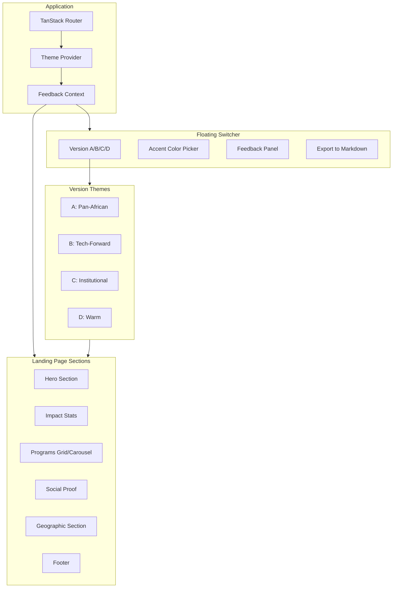

# ATF Prototype Explorer

## Architecture Overview



## Brand Colors (from ATF Logo)

| Color | Hex | Usage |

| ----------- | --------- | ----------------------- |

| Green | `#51b847` | Primary accent option |

| Yellow/Gold | `#fcba2f` | Secondary accent option |

| Red | `#ee4035` | Tertiary accent option |

| Dark | `#231f20` | Text, dark backgrounds |

---

## Phase 1: Foundation and Theme System

### 1.1 Project Structure

```
src/
├── components/
│   ├── ui/                    # shadcn components
│   ├── layout/
│   │   ├── Navbar.tsx         # Click-activated dropdowns
│   │   ├── MobileNav.tsx      # Hamburger slide-out drawer
│   │   └── Footer.tsx
│   ├── switcher/
│   │   ├── PrototypeSwitcher.tsx
│   │   ├── VersionSelector.tsx
│   │   ├── AccentPicker.tsx
│   │   └── FeedbackPanel.tsx
│   └── sections/
│       ├── Hero/
│       │   ├── HeroA.tsx      # Pan-African (CSS patterns)
│       │   ├── HeroB.tsx      # Tech-Forward (dark gradients)
│       │   ├── HeroC.tsx      # Institutional (photo-based)
│       │   └── HeroD.tsx      # Warm (organic shapes)
│       ├── Impact/
│       ├── Programs/
│       ├── SocialProof/
│       └── Geographic/
├── contexts/
│   ├── ThemeContext.tsx       # Version + accent state
│   └── FeedbackContext.tsx    # Ratings + notes state
├── hooks/
│   ├── useLocalStorage.ts
│   └── useTheme.ts
├── lib/
│   ├── themes.ts              # Theme definitions per version
│   └── feedback-export.ts     # Markdown export logic
└── routes/
    ├── __root.tsx
    ├── index.tsx              # Landing page
    ├── consulting.tsx         # Stub page
    ├── challenge.tsx          # Stub page
    └── chapters.tsx           # Stub page
```

### 1.2 Theme System

Create CSS custom properties that change based on active version:

- **Version A (Pan-African)**: Vibrant green/yellow/red, geometric African patterns, bold typography
- **Version B (Tech-Forward)**: Dark mode, cyan/purple gradients, sleek sans-serif
- **Version C (Institutional)**: Light, muted greens, professional serif accents, clean whitespace
- **Version D (Warm)**: Earthy browns/terracotta with green accents, organic rounded shapes

Each version will have its own accent color default but can be overridden via the picker.

### 1.3 LocalStorage Schema

```typescript
interface PrototypeState {
  activeVersion: "A" | "B" | "C" | "D";
  accentColor: string; // hex or preset name
  customColors: string[]; // user-saved custom colors
}

interface FeedbackState {
  elements: {
    [elementId: string]: {
      rating: 1 | 2 | 3 | 4 | 5 | null;
      preferredVersion: "A" | "B" | "C" | "D" | null;
      notes: string;
    };
  };
}
```

---

## Phase 2: Navigation and Floating Switcher

### 2.1 Navbar with Click Dropdowns

Using shadcn `DropdownMenu` with click trigger (not hover). Structure:

| Menu | Items |

| ------------- | -------------------------------------------------------- |

| Who We Are | Our Mission, Vision and Story; The Team And Contributors |

| What We Do | ATF Consulting; ATF Challenge; ATF Chapters |

| Where We Work | Ghana; Nigeria; Kenya; South Africa |

| Publications | Articles; Research Papers |

| News | (simple link) |

### 2.2 Mobile Navigation

Hamburger icon that opens a slide-out drawer (`Sheet` from shadcn) with accordion-style expandable sections.

### 2.3 Floating Prototype Switcher

Fixed position panel (bottom-right corner) with:

- **Minimize/expand toggle** (so it doesn't obstruct the view)
- **Version tabs**: A, B, C, D with visual indicators
- **Accent color picker**: Preset swatches (green, yellow, red) + custom hex input
- **Feedback button**: Opens the feedback panel

---

## Phase 3: Landing Page Sections (4 Variants Each)

### 3.1 Hero Section

| Version | Background | Animation Level | CTA Placement |

| ------- | --------------------------------------- | ------------------------------ | ------------------------- |

| A | CSS geometric patterns (kente-inspired) | Expressive (parallax, reveals) | Hero + Consulting section |

| B | Dark gradient with animated particles | Moderate (smooth transitions) | Sticky nav + Hero |

| C | Photo (award ceremony) with overlay | Subtle (fade-in only) | Hero + Consulting section |

| D | Warm gradient with organic blob shapes | Moderate (floating elements) | Multiple locations |

Headline: "Empowering Africa's Next Generation of Innovators"

### 3.2 Impact Stats Section

4 animated counters: 37+ Years, 30+ Chapters, 1000+ Participants, 100+ Articles

Styling varies by version but layout remains consistent.

### 3.3 Programs Section

| Version | Display | Animation |

| ------- | ----------------------- | ------------------------ |

| A | Horizontal carousel | Swipe with momentum |

| B | Static grid (3 columns) | Staggered fade-in |

| C | Static grid | Minimal hover states |

| D | Carousel | Gentle slide transitions |

Cards link to: `/consulting`, `/challenge`, `/chapters`

### 3.4 Social Proof Section

Partner logos from `/public/atf-assets/partners/` and `/public/atf-assets/supporters/`:

- 37 Military Hospital, BELA, Esoko, Korle Bu
- Blossom, Indaba, KNUST Rail, UoG

Plus proof points: AI Challenge framework mention, publications archive.

### 3.5 Geographic Section

| Version | Display |

| ------- | ------------------------------------------------------------------------------- |

| A, C, D | Card grid with country flags and links |

| B | Interactive map visualization (SVG-based Africa map with highlighted countries) |

Countries: Ghana, Nigeria, Kenya, South Africa

---

## Phase 4: Feedback System

### 4.1 Design Elements to Rate

| Element ID | Element Name |

| -------------------- | ------------------------ |

| `hero-style` | Hero Background Style |

| `hero-animation` | Hero Animation Level |

| `cta-placement` | CTA Button Placement |

| `nav-style` | Navigation Design |

| `programs-display` | Programs Section Layout |

| `geographic-display` | Geographic Section Style |

| `color-palette` | Overall Color Palette |

| `typography` | Typography Choices |

| `animations` | Animation/Motion Style |

| `overall` | Overall Impression |

### 4.2 Feedback Panel UI

Expandable panel within the switcher:

- List of elements with star rating (1-5)
- "Preferred version" selector per element
- Free-form notes textarea
- "Export Feedback" button

### 4.3 Markdown Export Format

```markdown
# ATF Prototype Feedback Summary

Generated: [date]

## Element Preferences

### Hero Background Style

- **Preferred Version**: B (Tech-Forward)
- **Rating**: 4/5
- **Notes**: Love the dark gradient, but could use more cultural elements

### CTA Placement

- **Preferred Version**: A (Pan-African)
- **Rating**: 5/5
- **Notes**: Hero + Consulting section placement feels natural

...

## General Notes

[Any overall feedback captured]
```

---

## Phase 5: Stub Pages and Polish

### 5.1 Stub Pages

Simple placeholder pages for:

- `/consulting` - ATF Consulting
- `/challenge` - ATF Challenge
- `/chapters` - ATF Chapters

Each shows the page title, brief placeholder text, and a "Back to Home" link. They inherit the active theme.

### 5.2 Responsive Design

- Desktop: Full navigation, side-by-side layouts
- Tablet: Condensed nav, 2-column grids
- Mobile: Hamburger menu, single column, touch-friendly switcher

### 5.3 Final Polish

- Smooth theme transitions (CSS transitions on custom properties)
- Loading states for images
- Accessibility audit (focus states, aria labels, color contrast)

---

## Key Files to Create/Modify

| File | Purpose |

| ------------------------------------------------------------------------------------------------ | --------------------------------------- |

| [`src/contexts/ThemeContext.tsx`](src/contexts/ThemeContext.tsx) | Version + accent color state management |

| [`src/contexts/FeedbackContext.tsx`](src/contexts/FeedbackContext.tsx) | Feedback ratings and notes |

| [`src/lib/themes.ts`](src/lib/themes.ts) | Theme definitions for all 4 versions |

| [`src/components/switcher/PrototypeSwitcher.tsx`](src/components/switcher/PrototypeSwitcher.tsx) | Main floating panel |

| [`src/components/layout/Navbar.tsx`](src/components/layout/Navbar.tsx) | Desktop nav with dropdowns |

| [`src/styles.css`](src/styles.css) | Extended with theme CSS variables |

---

## Execution Approach

I recommend building in this order:

1. **Foundation first**: Theme context, localStorage hooks, CSS variable system
2. **Switcher**: Get version switching working before building sections
3. **One section at a time**: Hero (all 4 variants) → Impact → Programs → Social Proof → Geographic
4. **Feedback system**: After sections are viewable
5. **Navigation and pages**: Navbar, mobile nav, stub pages
6. **Polish**: Animations, responsive tweaks, accessibility

This allows you to see and switch between versions early, making it easier to iterate on the aesthetics as we build.
